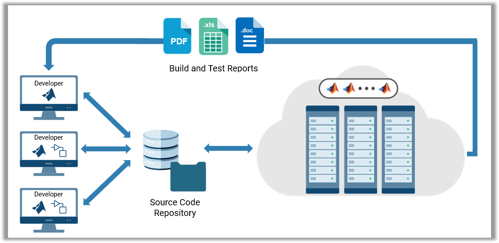
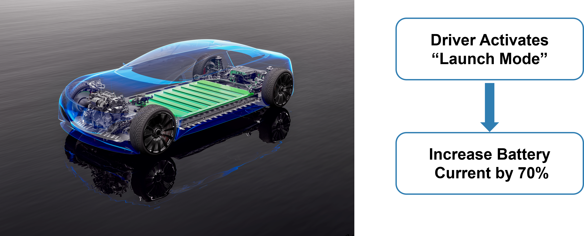
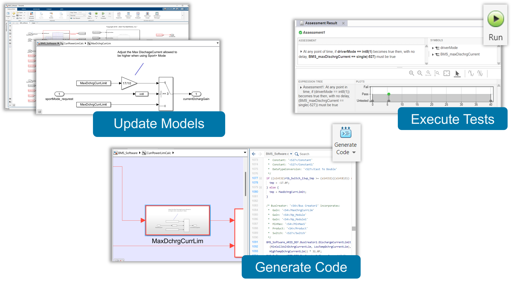
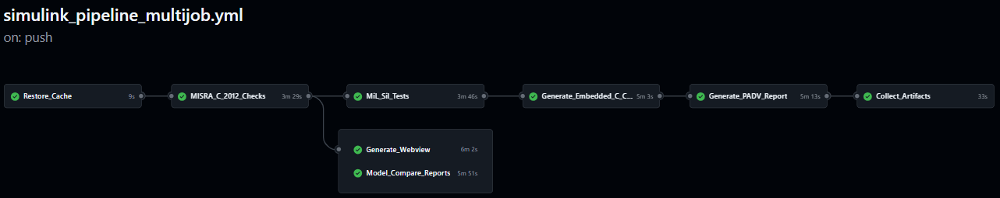

| **Branch - main** | **Branch - bFeature** |
|:---------------------------|:-----------------:|
|||

# Continuous Integration (CI) for MBD - Automate Model Testing and and Generate AUTOSAR Compliant Code

*Using automotive controllers as an example, let's learn how to setup CI pipelines and how it will benefit your team*

## Why Continuous Integration?
- Frequent integration: Developers regularly merge code changes into a shared repository
- Automated testing: Each merge triggers an automated build and test process
- Early error detection: CI identifies issues early, keeping the codebase stable and release-ready

When multiple engineers are involved in making algorthms, we need to ensure the changes being made are coordinated and thoroughly tested. Automating this work saves you a lot of time while preserving the quality of your code. 

## Demo Overview
In this example, we assume we are a team working to release a new "Launch Mode" for their electric cars. 

Update the Battery Management System (BMS) to increase the Max Discharge Current by 70%.

### What the MBD developer would do? 

### What the automated pipeline will execute?

--

## Key Features Showcased in this Demo
1. MATLAB Projects enable you to manage your environment and use source control
2. Process Advisor makes it easy to setup your CI pipeline, leveraging prebuilt tasks and a template process definition
3. Process Advisor enables you to auto generate YAML files for popular CI platforms (such as GitHub Actions), making it easy to adopt CI
4. The matlab-batch token enables you to license and execute multple jobs simulatenaously on different environemtns.
5. MATLAB can be containerized and executed on the automation environment of your choice.

## Relevant Apps/Workflows
- Use Continuous Integration (CI) to automate checks, tests and codeGen
- Running CI workflows within a docker container on the Cloud
- Use of the CI/CD support package for Simulink
- Using Projects and Source Control to manage your files/folders
- MISRA C Checks using Simulink Check
- MiL Testing with Simulink Test
- AUTOSAR - Generate Classic AUTOSAR compliant C code for BMS
- AUTOSAR - Generate Adaptive AUTOSAR compliant CPP code for VCU

## Relevant Products
Simulink, Stateflow, System Composer, Simulink Test, Embedded Coder, AUTOSAR Blockset, Simulink Check

## Recording
Join the live session at [MATLAB Expo 2025](https://www.matlabexpo.com/online/2025.html)

## Contact
Sameer K Muckatira, Jason Ghidella

## Relevant Industries
* MBD adopter who are looking to use Continuous Integration, and starting on DevOps
* Automotive customers doing AUTOSAR compliant code generation looking for MiL and SiL
